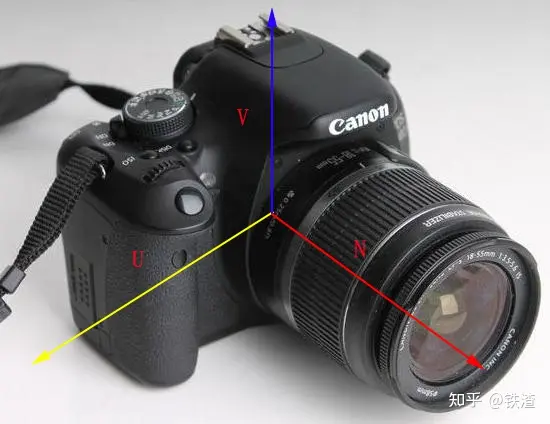
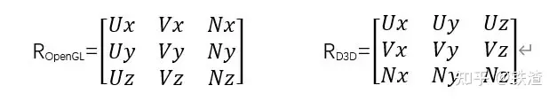
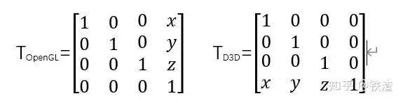
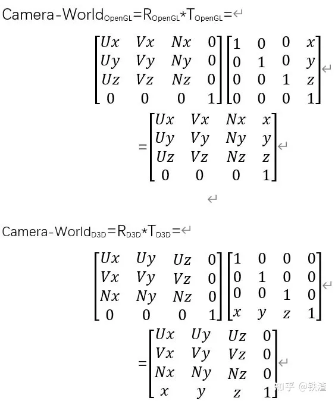
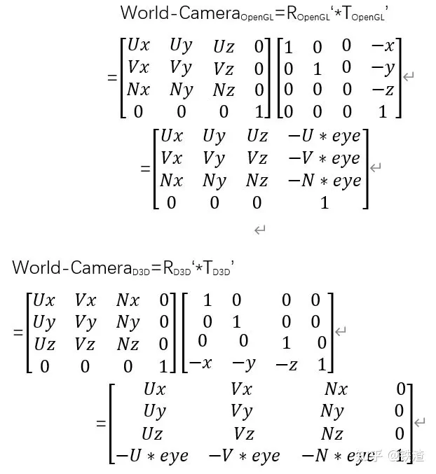

相机空间需要解决的典型的问题包括：

1、 这个物体在我的前方吗？

2、 这个物体在我的取景范围内吗？

3、 这个物体在我的左侧还是右侧？

4、 两个物体哪个离我更近？

这些问题决定了我们通过相机取景观察到的场景时，物体之间的位置关系，遮挡关系，甚至远小近大的比例关系，它们虽然不完全是通过相机变换来完成的，但是却由相机变换提供了实现它们所需要的基本信息。所以如何放置相机，以及如何完成世界-相机的转换就至关重要。

**UVN系统**

正如前面所言，一个相机系统的构建，需要解决相机前后、左右和上下等关系问题，那么我们直观的指定相机的这三个重要方向不就可以完美解决了吗？UVN相机系统正是这样应运而生的。

UVN系统确定了相机的方位

所谓UVN系统本质上就是在世界坐标参考系下，构成相机（世界坐标参考系下）的三个基向量，分别代表相机的右向、上向和后方（左手系则为前方），也就是确定了在x轴、y轴和z轴三个标准正交基，构成了一个相机坐标系（相机处于世界坐标原点），这本质上就是一个旋转矩阵的构成，在OpenGL和D3D框架下，它们具有不同的形态：

UVN构建的三个基向量旋转矩阵

不管是OpenGL还是D3D模式下，为了设置UVN相机的朝向，都需要提供相机的位置-eye，相机的观察目标-target，以及相机的正上方向量-up，这样才能既保证相机的观察方向，又能决定相机观测角度的偏转。有了三个基本信息，我们就可以在世界坐标中设置相机，并实现相机变换。

首先，我们根据相机位置eye和观察目标target，可以求出向量N：

N=target-eye

一个标准正交基我们需要保证N得到了标准化，此后就可以通过N和up叉乘，得到向量V，通常我们提供标准化后的up向量（0，1，0）：

V=N x up

在保证了三个向量都得到标准化（单位化）之后，我们就已经获得了UVN相机模型的三个基向量，这本质上是一个旋转矩阵，我们使相机在世界原点就行旋转，得到正确方位之后，剩下的就是将相机平移到合适的位置。

UVN相机系统的初始化过程中，相机的位置eye(x，y，z)正是相机平移的目标位置，作为一个平移矩阵，它被表示为：

eye位置坐标所构建的平移矩阵

有了相机的旋转矩阵R和平移矩阵T，就可以轻易的计算得出相机-世界矩阵：

相机-世界 矩阵的推导

以上推导出的两个矩阵，分别是OpenGL和D3D下，将相机矩阵置于世界坐标中的变换矩阵，也就是说将相机旋转到合适角度，并放置在世界坐标系中相应位置的变化矩阵。它实际上是由一个旋转矩阵R与一个平移矩阵T相乘的结果：

Camera-World=R*T

现在反过来思考，既然经过旋转和平移之后，可以得到相机-世界变换矩阵，那么当我们逆向去平移和旋转之后，得到的将是相机-世界的逆变换（逆矩阵），也就是世界转-相机矩阵，它的运算关系是：

世界-相机 变换矩阵

至此世界转换相机矩阵推导完成

## 法线矩阵推导

法线矩阵是一种用于变换法线向量的矩阵，常用于图形渲染中。下面是详细推导法线矩阵的过程：

假设有一个3x3的方阵M表示模型的变换矩阵，它包含了平移、旋转和缩放等变换。令N为法线矩阵，我们的目标是找到N，使得对于任意法线向量n，在进行模型变换后的结果满足新的法线向量n' = N * n。

1. 首先，我们需要明确法线向量的变换规律。在模型变换中，法线向量也会受到旋转部分的影响，而平移和缩放不会改变法线的方向。因此，我们只需关注旋转部分的变换。

2. 在3D空间中，一个向量在坐标系变换下的结果可以通过将向量与变换矩阵相乘得到。但是对于向量的变换，要使用变换矩阵的逆转置矩阵。因此，我们首先计算M的逆转置矩阵（记为R）。

   R = (M^(-1))^T

3. 然后，我们可以得到法线矩阵N。

   N = R

这样，对于给定的法线向量n，我们可以通过N * n来获得经过模型变换后的新法线向量n'。

需要注意的是，法线矩阵的计算只适用于刚体变换，即纯旋转和缩放变换。如果变换涉及到非刚性变换（如剪切或扭曲），则法线矩阵的计算方法会略有不同。

总结起来，法线矩阵的推导过程可以概括为：

1. 计算模型变换矩阵M。
2. 计算M的逆转置矩阵R。
3. 法线矩阵N等于R。 这样，通过将法线向量与法线矩阵相乘，就可以实现法线向量的正确变换。